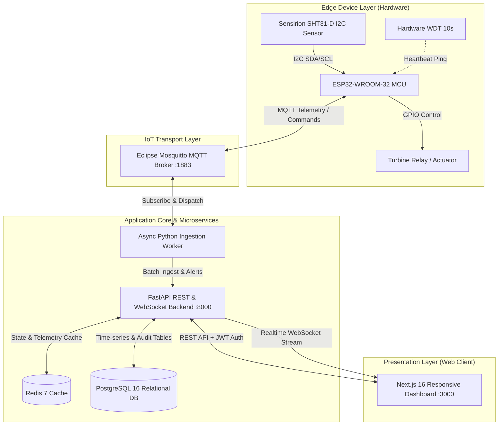

<div align="center">

# 🌬️ Satpayev Smart Air Purifier & IoT Telemetry Platform

**A full-stack, enterprise-grade Industrial IoT hardware-software complex for microclimate telemetry, predictive HEPA filter wear analysis, and bidirectional purifier fleet management.**

[](https://nextjs.org/)
[](https://reactjs.org/)
[](https://fastapi.tiangolo.com/)
[](https://www.python.org/)
[](https://mosquitto.org/)
[](https://www.postgresql.org/)
[](https://redis.io/)
[](https://www.espressif.com/)
[](https://www.docker.com/)
[](https://kubernetes.io/)

[Live Architecture](#-system-architecture) • [Key Capabilities](#-key-capabilities) • [Hardware & Firmware](#-hardware--firmware-specs) • [Tech Stack](#-technical-stack) • [Quickstart](#-quickstart-docker-compose) • [Test Suite](#-automated-testing--quality-assurance)

---

</div>

## 📌 Executive Summary

Commissioned for research and deployment at **Satbayev University** (Kazakh National Research Technical University), this platform connects physical air purification units to a centralized telemetry and diagnostic cloud. 

It addresses key industrial challenges:
* **Microclimate Monitoring**: Continuous, high-precision climate tracking ($\pm 0.3^\circ\text{C}$, $\pm 2\% \text{RH}$) via Sensirion SHT31 digital sensors.
* **Predictive Maintenance**: Mathematical motor-hours accumulation engine preventing delayed filter replacements and hazardous particulate saturation.
* **Bi-directional Remote Operations**: Sub-second remote actuation of turbine speeds and emergency shutdown via resilient MQTT pub/sub channels.
* **Role-Based Operational Security**: Multi-tenant RBAC (Administrator, Operator, Diagnostic Technician) with immutable cryptographic audit logging and incident tracing.

---

## 🏗️ System Architecture



---

## ✨ Key Capabilities

### 1. ⚡ Real-Time Streaming & Zero-Lag Analytics
* **Bi-directional WebSockets**: Live telemetry updates every second without full-page reloads.
* **Custom Responsive SVG Visualizations**: Smooth cubic-bezier temperature and humidity trendlines with interactive hover tooltips, live thresholds, and dynamic status indicators.
* **Autonomous Device Connectivity Watchdog**: Heartbeat timeout detector automatically marking idle devices as `OFFLINE` with visual warning badges.

### 2. 🛡️ Predictive HEPA Filter Wear Engine
* Precise formula tracking active motor operating hours:
  $$\text{Filter Remaining} = 100 \times \left(1 - \frac{\text{Hours Used}}{\text{Max Rated Lifespan}}\right)$$
* Visual circular progress gauges with adaptive color transitions (Emerald $\to$ Amber $\to$ Rose).
* Cryptographically authenticated maintenance reset mechanism requiring administrative or operator authorization with audit trail recording.

### 3. 👥 Enterprise RBAC & Multi-Account Session Switcher
* **Strict Role Segregation**:
  * **Administrator (ADMIN)**: Full access — threshold calibration, turbine actuation, filter reset, device registration, and system audit logs.
  * **Operator (OPERATOR)**: Operational monitoring, remote turbine on/off, and routine filter maintenance reset.
  * **Technician (TECH)**: Diagnostics and telemetry review in a secure, non-destructive read-only environment.
* **Instant Multi-Account Switcher**: Seamless 1-click account switching within the same browser session without re-entering credentials.

### 4. ⚙️ Dynamic Climate Thresholds & Validation Guardrails
* User-customizable thresholds for temperature alarm limits, humidity comfort zones, and HEPA replacement warnings.
* Real-time cross-field validation rules preventing illogical settings (e.g., Min Humidity $\ge$ Max Humidity).
* Atomic batch configuration updates stored directly in PostgreSQL with system diagnostics feedback.

### 5. 📜 Immutable Audit Logs & Telemetry Export
* Comprehensive event logging recording user identity, IP address, timestamp, and payload for all operational commands.
* 1-Click CSV telemetry export supporting offline analysis and reporting.

---

## 🧰 Technical Stack

| Domain | Technology | Description & Responsibility |
| :--- | :--- | :--- |
| **Frontend** | **Next.js 16 (React 19)** | Apple-grade minimalist dashboard with modular component architecture |
| **Styling** | **Vanilla CSS + Tailwind Utilities** | Bespoke design system, glassmorphism, responsive drawer, dark-accent touches |
| **Backend API** | **FastAPI (Python 3.11+)** | Asynchronous REST endpoints, Pydantic v2 schemas, WebSocket streaming |
| **Security** | **JWT (OAuth2) + Bcrypt** | Stateless cryptographic token authentication with role-based claim verification |
| **ORM & Database**| **SQLAlchemy 2.0 + PostgreSQL 16** | Robust relational persistence for telemetry measurements, users, and audit logs |
| **Caching** | **Redis 7 (Alpine)** | High-throughput transient state caching and session orchestration |
| **IoT Protocol** | **Eclipse Mosquitto (MQTT v3.1.1)**| Lightweight edge communication with QoS 1 message delivery guarantee |
| **Ingestion Engine**| **Python AsyncIO Worker** | Decoupled background service processing telemetry packets and heartbeats |
| **Embedded Firmware**| **C++ (PlatformIO / Arduino Core)** | Non-blocking ESP32 firmware with FreeRTOS multitasking and hardware WDT |
| **Orchestration** | **Docker Compose & Kubernetes** | Complete production manifests (Deployments, Services, StatefulSets, Ingress) |

---

## 🔬 Hardware & Firmware Specs

```text
       +---------------------------------------------+
       |             ESP32-WROOM-32 MCU              |
       |  Tensilica Dual-Core 32-bit CPU @ 240 MHz   |
       |  Wi-Fi 802.11 b/g/n + FreeRTOS Multitask    |
       +---------------------+-----------------------+
                             |
         +-------------------+-------------------+
         | (I2C Bus: GPIO21/22)                  | (GPIO Control: GPIO26)
         v                                       v
  +--------------+                       +---------------+
  | Sensirion    |                       | 12V DC Relay  |
  | SHT31 Sensor |                       | & Fan Turbine |
  +--------------+                       +---------------+
```

* **Microcontroller**: ESP32-WROOM-32 (240 MHz clock, 520 KB SRAM, 4 MB Flash).
* **Sensor**: Sensirion SHT31-D digital temperature & humidity sensor via I2C (`0x44`).
* **Fault Tolerance**: Hardware Watchdog Timer (WDT 10s), exponential MQTT reconnect backoff, and local sensor error detection.
* **Firmware Source**: Available in [firmware/](firmware/) with full PlatformIO configuration.
* **IoT Simulator**: High-fidelity Python simulator in [simulator/](simulator/) for hardware-independent development and continuous integration.

---

## 🚀 Quickstart (Docker Compose)

Spin up the entire microservice ecosystem with a single command:

```bash
# 1. Clone repository
git clone https://github.com/maoroch/air-satpayev-iot-platform.git
cd air-satpayev-iot-platform

# 2. Launch all microservices
docker compose up -d --build
```

### Access Points & Interfaces:
* **Web Dashboard**: [http://localhost:3000](http://localhost:3000)
* **Interactive Swagger API Docs**: [http://localhost:8000/api/v1/docs](http://localhost:8000/api/v1/docs)
* **ReDoc API Explorer**: [http://localhost:8000/api/v1/redoc](http://localhost:8000/api/v1/redoc)
* **MQTT Broker Endpoint**: `localhost:1883`

### Pre-Configured Demo Credentials:

| Role | Email | Password | Access Privileges |
| :--- | :--- | :--- | :--- |
| **Administrator** | `admin@satpayev.kz` | `Admin@2026!` | Full platform administration, thresholds, turbine actuation, audit log |
| **Operator** | `operator@satpayev.kz` | `Operator@2026!` | Turbine on/off, telemetry monitoring, HEPA filter maintenance reset |
| **Technician** | `tech@satpayev.kz` | `Tech@2026!` | Equipment diagnostics, sensor calibration inspection (Read-only) |

---

## 🧪 Automated Testing & Quality Assurance

The codebase includes an extensive suite of automated unit and end-to-end integration tests:

```bash
# Run test suite inside virtualenv
pytest -v backend/tests/
```

```text
===================================================================== test session starts =====================================================================
collected 17 items

backend/tests/test_backend.py::test_device_status_online PASSED                                                                                          [  5%]
backend/tests/test_backend.py::test_jwt_auth_and_roles PASSED                                                                                            [ 11%]
backend/tests/test_backend.py::test_filter_calculation_formula PASSED                                                                                    [ 17%]
backend/tests/test_backend.py::test_filter_reset_and_audit PASSED                                                                                        [ 23%]
backend/tests/test_backend.py::test_command_dispatch_and_execution PASSED                                                                                [ 29%]
backend/tests/test_e2e_acceptance.py::test_at_01_user_authentication_success PASSED                                                                       [ 35%]
backend/tests/test_e2e_acceptance.py::test_at_02_user_authentication_invalid_credentials PASSED                                                          [ 41%]
backend/tests/test_e2e_acceptance.py::test_at_03_telemetry_stream_monitoring PASSED                                                                      [ 47%]
backend/tests/test_e2e_acceptance.py::test_at_04_device_control_fan_toggle PASSED                                                                        [ 52%]
backend/tests/test_e2e_acceptance.py::test_at_05_hepa_filter_reset PASSED                                                                                [ 58%]
backend/tests/test_e2e_acceptance.py::test_at_06_climate_threshold_validation PASSED                                                                     [ 64%]
backend/tests/test_e2e_acceptance.py::test_at_07_device_offline_detection PASSED                                                                         [ 70%]
backend/tests/test_e2e_acceptance.py::test_at_08_rbac_permission_matrix PASSED                                                                           [ 76%]
backend/tests/test_e2e_acceptance.py::test_at_09_audit_trail_logging PASSED                                                                              [ 82%]
backend/tests/test_e2e_acceptance.py::test_at_10_csv_telemetry_export PASSED                                                                             [ 88%]
backend/tests/test_e2e_acceptance.py::test_at_11_mqtt_message_dispatch PASSED                                                                             [ 94%]
backend/tests/test_e2e_acceptance.py::test_at_12_system_diagnostics_uptime PASSED                                                                        [100%]

====================================================================== 17 passed in 1.48s =====================================================================
```

---

## 📂 Repository Directory Structure

```text
.
├── backend/                # FastAPI backend (REST API, WebSocket, SQLAlchemy, Pydantic)
│   ├── app/                # Application modules (api, core, db, schemas, services)
│   └── tests/              # 17 automated unit and acceptance test suites
├── frontend/               # Next.js 16 Web Dashboard (React, TypeScript, Vanilla CSS)
│   └── src/
│       ├── app/            # App router pages (dashboard, login)
│       └── components/     # UI components (charts, drawer, diagnostics, modals)
├── device_adapter/         # Python Async Ingestion Worker (MQTT listener & heartbeat watchdog)
├── firmware/               # ESP32 C++ firmware (PlatformIO, FreeRTOS, I2C SHT31 driver)
├── simulator/              # Standalone Python IoT Telemetry Simulator
├── k8s/                    # Production Kubernetes manifests (Deployments, Services, ConfigMaps)
├── mosquitto/              # Eclipse Mosquitto MQTT configuration
├── scripts/                # Utility scripts (backup/restore, synchronization)
└── docker-compose.yml      # Complete microservice orchestration
```

---

## 📄 License & Attribution

Designed and developed as an engineering showcase and applied research project for **Satbayev University**.

**Lead Engineer / Developer**: [maoroch](https://github.com/maoroch)  
**Affiliation**: Satbayev National Research Technical University (КазНИТУ им. К.И. Сатпаева)
