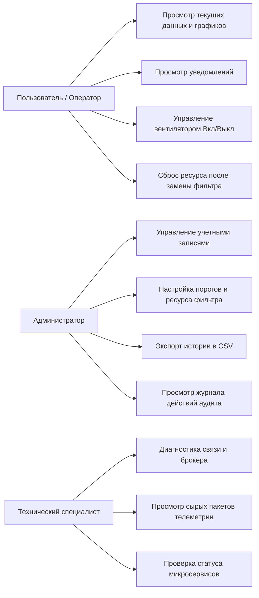

# Анализ требований к цифровой системе мониторинга и управления устройством очистки воздуха

**Основание разработки**: Приложение № 2 к Договору оказания услуг № _____ от «___» ______ 2026 г.  
**Заказчик**: НАО «Казахский национальный исследовательский технический университет имени К.И. Сатпаева»  
**Этап 1**: Инженерно-программный анализ требований к цифровой системе мониторинга и управления устройством очистки воздуха, включая подготовку технических решений, структуры модулей и логики работы системы.

---

## 1. Назначение и границы системы

### 1.1. Назначение системы
Цифровая система предназначена для непрерывного мониторинга микроклиматических параметров (температура, относительная влажность), контроля технического состояния и износа фильтрующего элемента, отображения статуса связи и управления компактным бытовым устройством очистки воздуха через современный веб-интерфейс.

### 1.2. Границы ответственности и безопасности (Раздел 4 ТЗ)
1. **Низковольтный контур**: Разрабатываемое программное обеспечение и модуль контроллера взаимодействуют исключительно с низковольтной цепью прибора (3.3В / 5В).
2. **Исключение высоковольтного вмешательства**: Проектирование силовой части 220 В, разработка пресс-форм корпуса, серийная сертификация прибора не входят в обязанности Исполнителя и остаются на стороне Заказчика.
3. **Физическая интеграция**: При невозможности безопасного размещения контроллера внутри штатного корпуса без ухудшения аэродинамики или электробезопасности, ТЗ допускает подключение внешнего согласованного сенсорного модуля (п. 5.5 ТЗ).

---

## 2. Матрица функциональных требований (FR-01 — FR-20)

| Идентификатор | Название функции | Содержание требования | Приоритет |
| :--- | :--- | :--- | :--- |
| **FR-01** | Авторизация | Вход по логину/паролю, генерация JWT-токенов, защита от перебора, корректные сообщения об ошибках без утечки системных данных. | Высокий |
| **FR-02** | Пользователи и роли | Поддержка 3 ролей: Администратор, Оператор/Пользователь, Технический специалист. Серверная проверка полномочий (RBAC). | Высокий |
| **FR-03** | Регистрация устройства | Учет устройств с уникальным идентификатором `device_id`, серийным номером, моделью и сетевыми параметрами. | Высокий |
| **FR-04** | Статус связи (Heartbeat) | Определение Online/Offline по интервалу последнего полученного сообщения телеметрии (тайм-аут по умолчанию — 30 сек). | Высокий |
| **FR-05** | Мониторинг температуры | Прием фактической температуры с датчика (°C), валидация физического диапазона (-10..+60 °C), фильтрация аномалий. | Высокий |
| **FR-06** | Мониторинг влажности | Прием фактической относительной влажности (%), валидация диапазона (0..100%), сохранение в историю с таймстемпом. | Высокий |
| **FR-07** | Расчет ресурса фильтра | Учет наработанных моточасов вентилятора, процент износа относительно настраиваемого нормативного ресурса (по умолч. 720 ч), фиксация факта сброса/замены. | Высокий |
| **FR-08** | Расширяемость датчиков | Модульная архитектура пакета данных для бесшовного добавления датчиков PM2.5, PM10, VOC, CO₂ без изменения структуры ядра. | Средний |
| **FR-09** | История измерений | Сохранение временных рядов в БД, вывод в виде динамических графиков и таблиц за выбранные периоды (1 час, 24 часа, 7 дней, месяц). | Высокий |
| **FR-10** | Уведомления и алерты | Генерация событий: превышение порогов, потеря связи (Offline), выработка ресурса фильтра (>90%, 100%). Дедупликация (без повторного спама). | Высокий |
| **FR-11** | Команды управления | Отправка команд на прибор через MQTT: включение/выключение вентилятора, сброс аварии, изменение интервала передачи. | Средний |
| **FR-12** | Подтверждение команд | Асинхронное подтверждение (ACK) от устройства: статусы «Отправлено», «Подтверждено», «Тайм-аут/Ошибка». | Средний |
| **FR-13** | Журнал событий (Audit) | Запись входов в систему, действий администратора, сбросов фильтра, критических системных предупреждений. | Средний |
| **FR-14** | Конфигурация порогов | Возможность изменения порогов предупреждений, нормативного ресурса фильтра и таймаута связи через интерфейс администратора. | Средний |
| **FR-15** | Экспорт данных | Выгрузка отфильтрованной истории телеметрии в формате CSV с корректными заголовками и локализованными датами. | Средний |
| **FR-16** | Диагностика | Вывод для технического специалиста: время последнего пинга, версия прошивки/бэкенда, статус подключения к БД и брокеру. | Средний |
| **FR-17** | Резервное копирование | Наличие скриптов создания дампа PostgreSQL и восстановления базы данных на чистой машине. | Высокий |
| **FR-18** | Мультиустройственность | Возможность подключения нескольких воздухоочистителей к одной платформе. | Средний |
| **FR-19** | Изоляция тестовых данных| Программный эмулятор прибора для автономных тестов, маркировка тестового трафика для исключения искажения рабочей статистики. | Высокий |
| **FR-20** | Версионирование | Фиксация версий API, схемы БД и исходного кода согласно спецификации релиза. | Высокий |

---

## 3. Пользовательские роли и сценарии (Use Cases)

---

## 4. Реестр открытых технических вопросов (Приложение Е ТЗ)

1. **Микроконтроллер**: Рекомендован чип **ESP32-WROOM-32** (наличие Wi-Fi 802.11 b/g/n, аппаратный I2C, 32-битное двухъядерное ядро, поддержка FreeRTOS).
2. **Протокол телеметрии**: **MQTT (v3.1.1)** через брокер Mosquitto с гарантией доставки QoS 1 для команд и QoS 0 для непрерывной телеметрии.
3. **Модель сенсора**: Цифровой калиброванный датчик **SHT31 / AHT20** с точностью измерения температуры ±0.3 °C и влажности ±2%.
4. **Статус вентилятора**: При наличии низковольтного сигнала тахометра или ключа MOSFET считывается реальное состояние GPIO; при отсутствии — программный статус последней отправленной команды с пометкой в карточке прибора.
5. **Нормативный ресурс фильтра**: По умолчанию устанавливается 720 часов (30 суток непрерывной работы) с возможностью перенастройки в панели администратора от 100 до 5000 часов.
