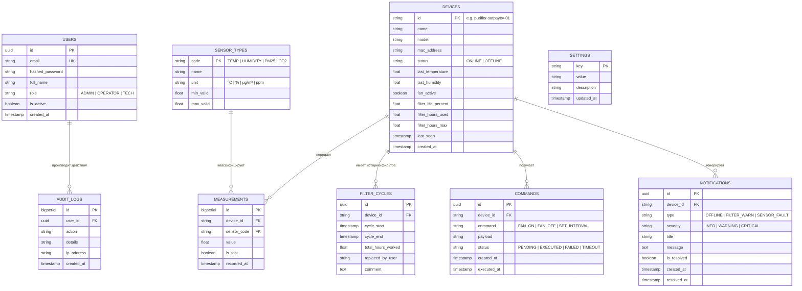

# Программная архитектура цифровой системы мониторинга и управления устройством очистки воздуха

**Этап 2**: Проектирование программной архитектуры системы, включая описание взаимодействия модулей, потоков данных, пользовательских функций, административных функций и механизмов обработки параметров устройства.

---

## 1. Концепция микросервисной архитектуры

Архитектура системы построена по модульному слабосвязанному принципу, изолирующему сетевой протокол физического прибора от пользовательского веб-интерфейса и сервисов хранения.

```mermaid
flowchart TB
    subgraph EdgeDevice["Периферийный уровень (Прибор очистки воздуха)"]
        Sensors["Датчики I2C (Температура, Влажность)"] --> MCU["ESP32 (PlatformIO / FreeRTOS)"]
        Fan["Вентилятор / Ключ управления"] <--> MCU
        Sim["Программный симулятор (Python)"]
    end

    subgraph Transport["Транспортный уровень IoT"]
        Mosquitto["MQTT Broker (Eclipse Mosquitto :1883)"]
    end

    subgraph BackendCluster["Микросервисный кластер Kubernetes / Docker"]
        Adapter["Адаптер Ingestion (device_adapter)"]
        API["Core API & Auth (FastAPI :8000)"]
        Worker["Filter & Alarm Worker"]
        DB[("PostgreSQL 16 (Основное хранилище)")]
        RedisCache[("Redis 7 (Кэш телеметрии & Pub/Sub)")]
    end

    subgraph ClientLayer["Клиентский уровень"]
        Nginx["Ingress / Reverse Proxy"]
        Frontend["Web UI (Next.js :3000)"]
        Browser["Веб-браузер пользователя"]
    end

    MCU -->|MQTT: devices/{id}/telemetry| Mosquitto
    Sim -->|MQTT: devices/{id}/telemetry| Mosquitto
    Mosquitto -->|Подписка на телеметрию| Adapter
    
    Adapter -->|Сохранение измерений| DB
    Adapter -->|Обновление статуса Online/Кэша| RedisCache
    Adapter -->|Публикация в WebSocket шину| RedisCache

    API <-->|Чтение истории и агрегатов| DB
    API <-->|Кэш устройств и сессий| RedisCache
    API -->|Отправка команд MQTT: devices/{id}/commands| Mosquitto

    Worker -->|Периодический пересчет ресурса фильтра| DB
    Worker -->|Генерация дедуплицированных алертов| DB

    Frontend <-->|REST API / HTTP JSON| API
    Frontend <-->|WebSocket: /ws/telemetry| API
    Browser <--> Frontend
```

---

## 2. Схема базы данных (ER-диаграмма)

В соответствии с разделом 9 Технического задания в базе данных выделяются следующие сущности:



---

## 3. Механизм обработки параметров и расчета износа фильтра (п. 5.3 ТЗ)

1. **Принцип наработки**:
   * При каждом получении пакета телеметрии с флагом `fan_active == true` система фиксирует время фактической работы вентилятора.
   * Накопленное время $\Delta t$ суммируется к `filter_hours_used`.
   * Текущий ресурс рассчитывается по формуле:
     $$\text{Filter Life (\%)} = \max\left(0, 100 \cdot \left(1 - \frac{\text{filter\_hours\_used}}{\text{filter\_hours\_max}}\right)\right)$$
2. **Оповещения о деградации**:
   * При достижении 90% выработки ресурса формируется предупреждение `WARNING` («Ресурс фильтра подходит к концу»).
   * При 100% формируется алерт `CRITICAL` («Требуется срочная замена фильтра»).
   * Оповещения дедуплицируются: система не генерирует повторный алерт при каждом 5-секундном тике, пока предыдущее состояние не изменится или не будет сброшено.
3. **Фиксация замены фильтра**:
   * Авторизованный оператор нажимает «Подтвердить замену фильтра».
   * Сервер закрывает текущий цикл в `FILTER_CYCLES`, сбрасывает `filter_hours_used = 0` и фиксирует действие в журнале `AUDIT_LOGS`.
